# Shadowplay like functionality on Linux using OBS

*A sink is an output device, you "sink" the audio into it. The sound card your speakers are connected to is a sink*
If you wish to be able to pick which sounds that is included in your clips you need to follow all steps, if you do not care about this you can jump straight to the section for OBS install *section 2.1* then to the NVENC config *section 2.2.4*


## 1 PulseAudio
If you wish to be able to pick which sounds to include in your clips you will have to make some simple changes to pulseaudio

### 1.1 Find your preffered sample rate
If the sample rates do not match the real sink you use on the virtial sinks we will create you might get strange artifacts, crackling, stuttering, or in my case a strange tinncan like overtone.
Now your devices might be able to do much better, but I opted to go with the rate that pulseaudio already put on my speakers sink.

You can check (and please check both) your default samplerate like this:
Default sample rate:

```
$ pactl info
Server String: /run/user/1000/pulse/native
Library Protocol Version: 32
Server Protocol Version: 32
Is Local: yes
Client Index: 31
Tile Size: 65472
User Name: thomas
Host Name: dsk01
Server Name: pulseaudio
Server Version: 12.2
Default Sample Specification: s16le 2ch 48000Hz
Default Channel Map: front-left,front-right
Default Sink: alsa_output.pci-0000_08_00.3.analog-stereo
Default Source: alsa_input.usb-Blue_Microphones_Yeti_Stereo_Microphone_REV8-00.analog-stereo
Cookie: dc2c:6774
```
Default sink sample rate: 

```
$ pactl list sinks | grep -B2 -A5 "Name: $(pactl info | grep "Default Sink" | rev | cut -d" " -f1 | rev)"
Sink #0
        State: SUSPENDED
        Name: alsa_output.pci-0000_08_00.3.analog-stereo
        Description: Family 17h (Models 00h-0fh) HD Audio Controller Analog Stereo
        Driver: module-alsa-card.c
        Sample Specification: s16le 2ch 48000Hz
        Channel Map: front-left,front-right
        Owner Module: 10

```
In my case the sample rate was configured for  48000Hz sample rate, the problem was that the virtual sinks would be created with 44100Hz sample rate, lets fix that in 1.2

### 1.2 Set your default sample rate
Use the info gathered in 1.2, or if you know what sample rate you want use that to set the default sample rate.

Create  the personal config dir for pulse if it does not exist and edit the daemon.conf file
```
$ mkdir -p ~/.config/pulse
$ vim ~/.config/pulse/daemon.conf 
```
I had to avoid resampling to escape sound artifacts, but that may not be needed in your case:
```
avoid-resampling = yes
default-sample-rate = 48000
```

### 1.3 Create virtual sinks for game and voice sounds
This is where we create the virtual sinks that will only contain the game sounds and the voice communication sounds.

First copy the system default pulseaudio file as your personal config file:
```
$ mkdir -p ~/.config/pulse
$ cp /etc/pulse/default.pa ~/.config/pulse/default.pa
```
Now we will add our virtual sinks at the end of the new config file, open it and go to the bottom:

```
$ vim ~/.config/pulse/default.pa
```
At the end of the file add the following:

```
## Create Null Sink for Voice Communication
load-module module-null-sink sink_name=CommNullSink sink_properties=device.description="CommNull"
## Create Combined Sink for Voice Communication
load-module module-combine-sink sink_name=CommCombinedSink sink_properties=device.description="CommCombined" slaves=@DEFAULT_SINK@,CommNullSink

## Create Null Sink for Game Sounds
load-module module-null-sink sink_name=GameNullSink sink_properties=device.description="GameNull"
## Create Combined Sink for Game Sounds
load-module module-combine-sink sink_name=GameCombinedSink sink_properties=device.description="GameCombined" slaves=@DEFAULT_SINK@,GameNullSink
```
This will add 4 new output devices (sinks) to your system.
One null sink for each of the game and one for the voice communications application, the null sink will only be used by OBS.
One combined sink for each of the game and voice communications applications, this is where we will send the sound from the applications, it will pass it on to BOTH the null sink and your default sink (your speakers).

If you do not wish to reboot you can try to logout, or restart pulseaudio, but application might need a reload of the sound engine or restart of the application, f.ex: firefox tab will need a reload, csgo will need to run the command snd_restart

```
pulseaudio -k
pulseaudio --start
```
If you encounter problems check the logs, and make sure you did not make any spelling mistakes `journalctl -b0 | grep pulseaudio`

### 1.4 Change sink for the game and voice application
For this part we will use a gui application because that is way easier than fille with `pactl` or `pacmd` in my opinion at least.
If you do not have it installed, or are more comfertable with your system audio settings application you do not have to use what I use.

Install `pavucontrol`, it is a **P**ulse**A**udio **V**ol**U**me **CONTROL** application that is easy to use and does what you ask.

```
$ sudo apt install pavucontrol
```
Start your game and voice application, I will use teamspeak and CSGO as my example applications.
When those are started up, start pavucontrol, either from the application menu or from the terminal, it does not matter.

When they are started up, go to pavucontrol and in the playback tab, change where they output to:

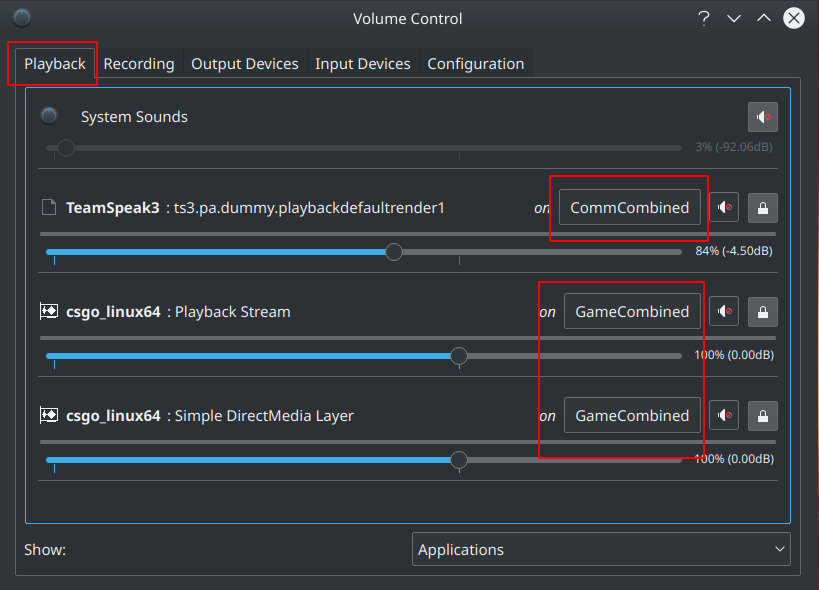

By sending the audio to the virtual combined sink for the respective applications (communications sink and game sink), the combined sink will pass the sound on to our default sink and the virtual null sink.
The default sink is so we can hear the audio ourselvs, and the null sink is so we can record the sounds in a dedicated channel in OBS.

Thats it for PulseAudio, time to work on our OBS setup, so many images coming up...

## 2 OBS
For this you will need a version of OBS and ffmpeg that both support NVENC (or what ever encoding you want to use), I will use the snap version for both obs-studio and ffmpeg, if you do not wish to use them make sure your version support your preffered encoding. Worst case senario you can use a self compiled version, this might help you with ffmpeg, but might also be outdated:  https://github.com/thomasfinstad/tipsntricks/tree/master/ffmpeg-nvenc-ubuntu-16.04

### 2.1 Install ffmpeg and obs-stuido
If you do not know what snapps are: https://snapcraft.io/ (trust me spotify does not get much simpler than `snap install spotify` wink wink)
If you do not have snap installed you might be able to install it from your repos, the usual name of the package is *snapd*.

```
$ sudo snap install ffmpeg obs-studio
$ snap list
```
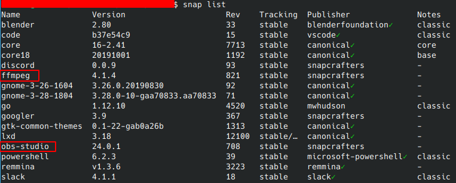

### 2.2 Configure OBS
This is by NO means an exhaustive OBS guide, I will try to add what is needed to get it up and running, but you must figure out streaming settings etc yourself. There are so many guides and videos on the subject that we should stick to what we are doing.

#### 2.2.1 Add game video input
Add your game as a window capture in obs, I found the screen capture to be very laggy when playing.

Under Sources press the big **+** button and choose Window Capture:

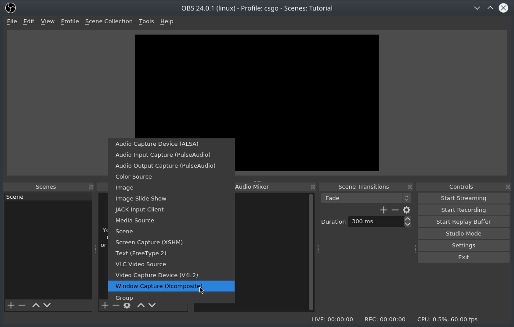

Give the source a descriptive name for the game (or whatever other window you want to capture):

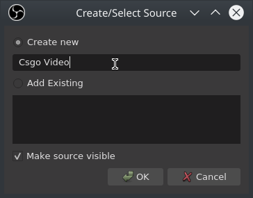

Choose the window for your application (must be running, just alt-tab out):

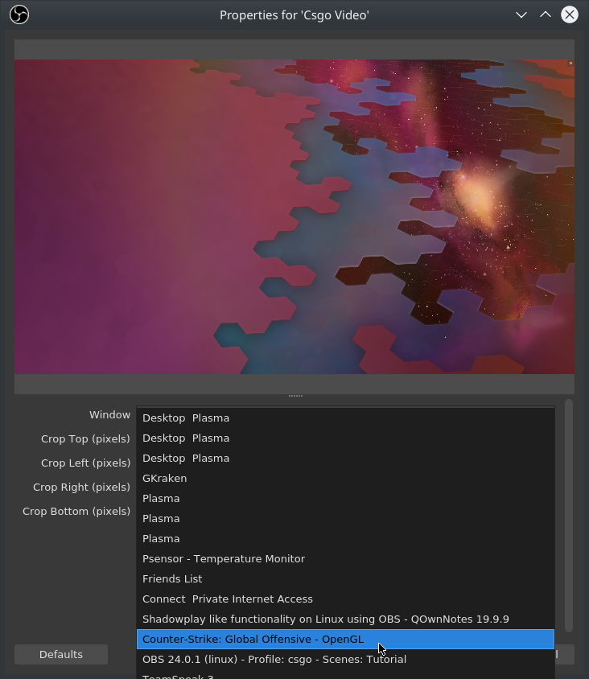

If the source does not fit your full preview window (look at the red outline, the game might not show if it is minimized / alt-tabbed out of) right click it, pick transform and strech to screen. More than that is not part of this guide, just duckduckgo around.

#### 2.2.2 Add audio inputs
Under sources, press the large **+** button and choose Audio Output Capture:

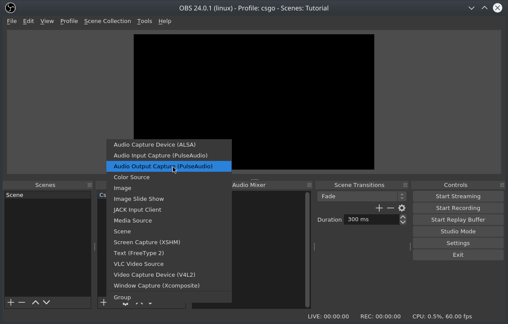

Give the audio capture a name that is descriptive, like "Voice Comms" / "Game Sounds", whatever you like:

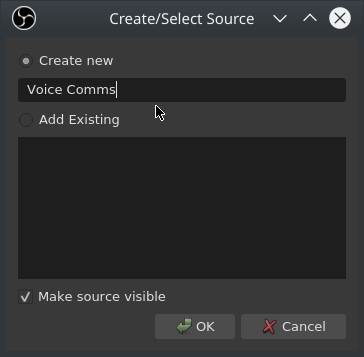

Select the Null sink for your audio, game or voice:

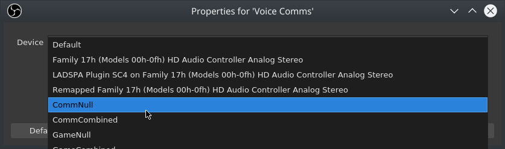

Repeat this step for at least these:

* Voice comms
* Game sounds

#### 2.2.3 Audio Settings
Now comes the part where you need to keep your mind on task, it can easily get confusing.
First open the OBS Settings and go to the audio section:

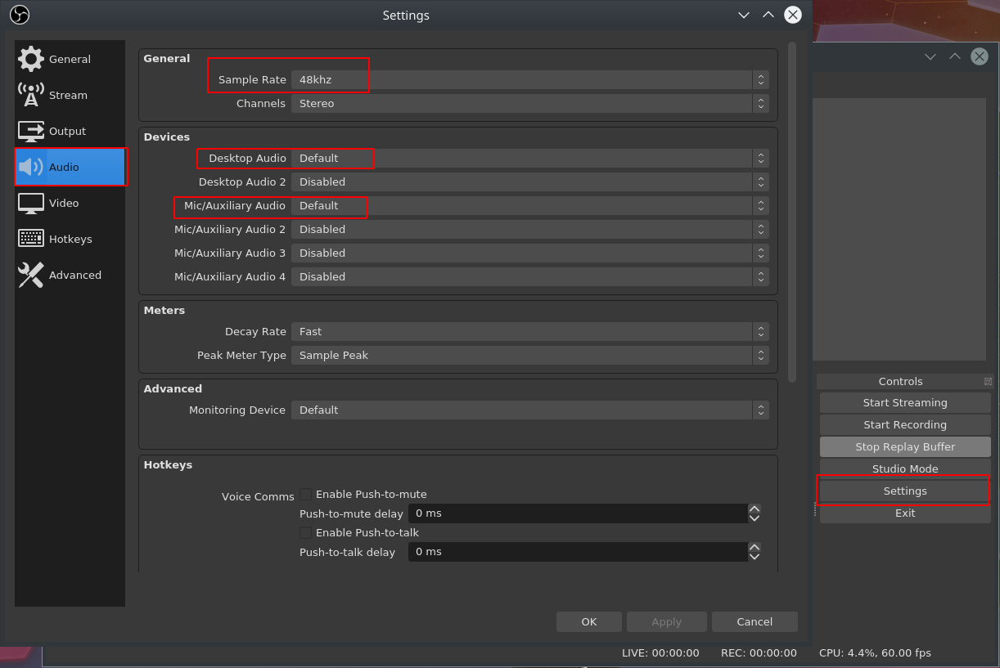

I do not know if the sample rate here is important to match to your speakers, I did not have any issue even when it did not match, but I changed it while writing this guide to match what we found in section 1.1, Just make sure your desktop and mic audio is configured propperly, normally you should not need to change anything, or just set it to default (that means your system default devices).

Now we will do the "advanced audio" setup that will let you split the audio into several tracks in your recorded video files:

Under the output section, enabled advanced mode and go to the recording tab, enable all 6 audio tracks, we might not need them all right now, but I do not see the hurt in enebaling them all right away.

Enable generate filenames without spaces, this is easier if you wish to use my helper function for cliping the video later (tab completion of filenames etc), and seriously, who ever allowed spaces in filenames needs a good flogging.

Then click apply (not OK):

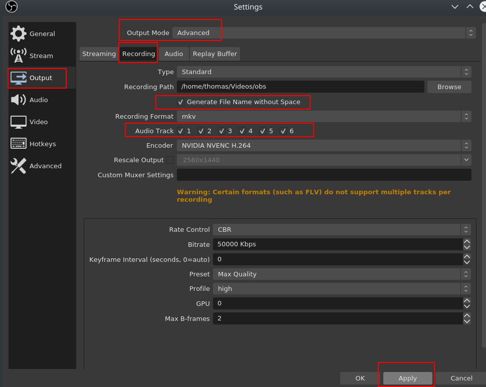

I wont add another image for this, but click the streaming tab and make sure the audio track is set to 1, we will use this as a "caputer all output and input" channel.

Press OK to close the Settings window.

Now we will set which audio will go to which channel, if you wish to use my helper bash function later it is important that you match what I have done, this helper (section 3) will help you cut your clips with the correct audio, pick out what parts you want, and make the file smaller before uploading to sites like youtube.

In the main OBS window clik the little gear icon next to one of the audio sources in the audio mixer section, and press Advanced Audio Properties:

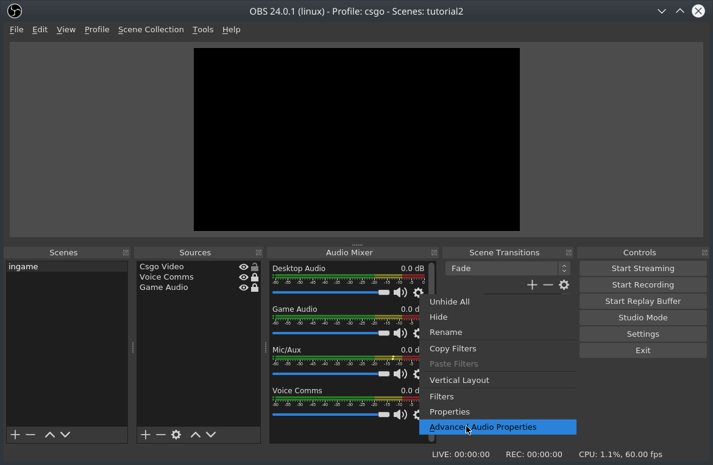

Now set the different audio tracks as follows:

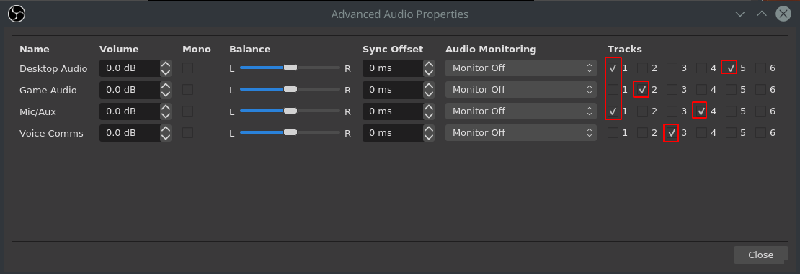

* Track 1: Desktop Audio, and Mic/Aux *This will make track one capture all output and input*
* Track 2: Game Audio *This track will only contain our game sounds output*
* Track 3: Voice Comms *This track will only contain our voice application output*
* Track 4: Mic/Aux *This track will only contain our microphone input*
* Track 5: Desktop Audio *This track will contain sound outpout from all applications*
* Track 6: unused *we didnt have anything to put here, but if you are able to understand what we did you can put a music track here or whatever you wish*

#### 2.2.4 NVENC Settings in OBS
Now the part that makes it so we can play the game without loosing over 9000 fps, HW accelerated recording of video.
If you are only here for this part that should not be a problem as I have written the other parts in a way that does not interfere with this part, if you see a setting in the screenshots that does not make sense to you, dont think about it.

Open the OBS settings window, go to the Output section and enable advanced mode, open the recording tab and Set the recording format to mkv, pick the encoder as NVIDIA NVENC H.264, in the lower half set the rate control to CBR and pick 50 000 Kbps, you might not need this much, but with this setting I did not notice any issues with fast gameplay having quality issues, it will consume around 2GB per 5min clip you save so make your choice of kbps based on how much space you have. I did zero investigation of lower bitrates than 50k.

Enable generate filenames without spaces, this is easier if you wish to use my helper function for cliping the video later (tab completion of filenames etc), and seriously, who ever allowed spaces in filenames needs a good flogging.

Hit Apply

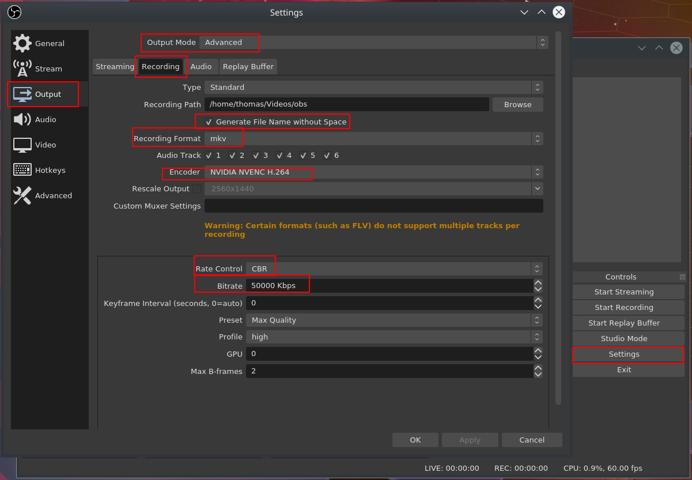


Great, we can now record, who cares? Lets do the shadowplay functionality next. Open the tab called Replay Buffer, pick Enable Replay Buffer and set how much time you wish to keep in memory, this will depend on how much ram you have, and how high your bitrate is set, if you can not get as long a clip as you wish in ram, lower the bitrate at which the clips are generated.

Hit Apply

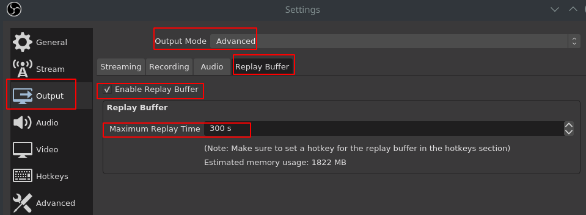

Now we need a HotKey to save our clips, got to the Hotkeys section, search for replay and pick a hotkey to save your clips, and if you wish a way to start/stop the replay buffer, I will show you how to autostart the replay buffer on startup of OBS if that is preferable to you in the next section.

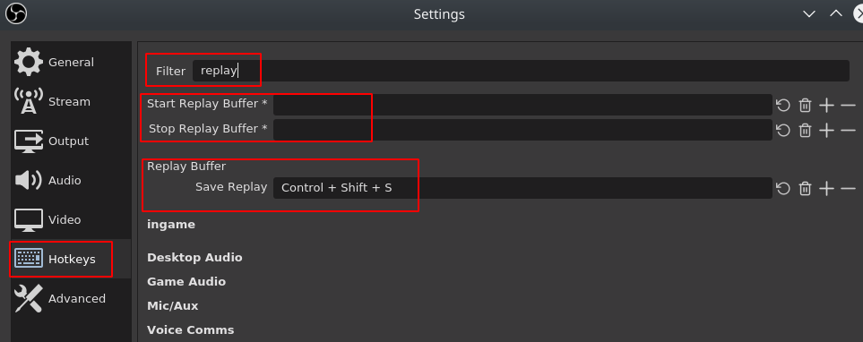

If you wish to setup NVENC streaming for twitch remember to keep it to their recommended kbps. https://stream.twitch.tv/encoding/

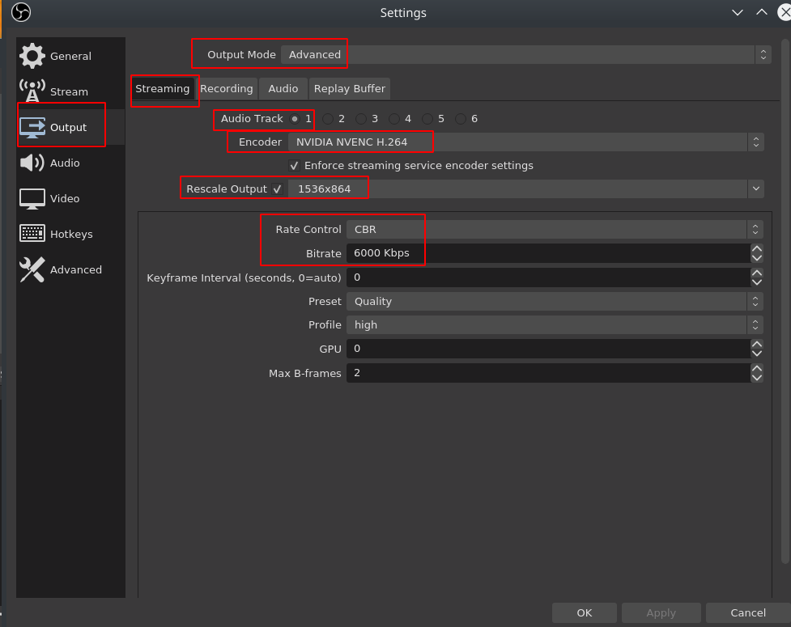

When you save your clips it will save to the recording folder for OBS with Replay prefixed to the name.

#### 2.2.5 Auto start replaybuffer

If you wish obs to autostart the replaybuffer when you start the application all you have to do is add *--startreplaybuffer* at the end of the command, so if you start it from the commandline it would be `$ obs-studio --startreplaybuffer`.

I start it from the applications menu so I have to edit the menu entry and add it at the end there:

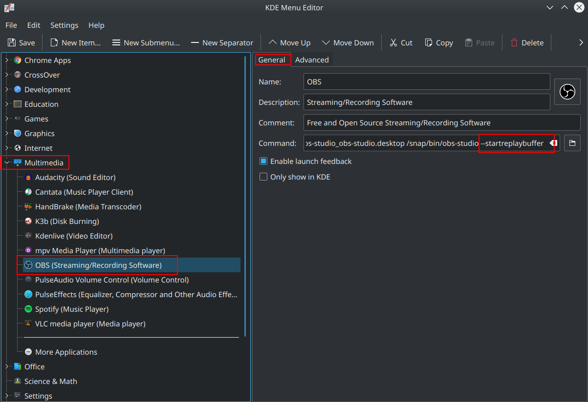

But with steam games I autostart OBS on game launch, in your steam library right click the game, click properties, in the general tab, press set launch options and add *obs-studio --startreplaybuffer & %command%* this will start obs and then run your game, but be aware that steam will think you are in the game until both the game and obs is stopped.

## 3 Clip cutting

I could not find an application that could cut the clip where I wanted, re-encode it in a lower bitrate (smaller size) and let me pick the audio tracks I wanted to keep, so I made a small bash helper function.

### 3.1 Install cli function
Create a file that you can source, if you do not have any file yet you can copy it into your bashrc file:

`$ vim ~/.bashrc`

And paste the content from obs-cut.bash, then include the file after you save it (`$ source ~/.bashrc`)

[obs-cut.bash](attachments/obs-cut.bash)

### 3.2 Example usage

If you wish to use it this is how:

* Go to the folder where your clips are stored,
* Figure out where you wish to clip from or to
* Figure out which audio tracks to keep
* Run the command

Usage help: `obs-cut -h`

example file: Replay_2019-10-09_19-04-19.mkv

* Only re-encode: `$ obs-cut -i Replay_2019-10-09_19-04-19.mkv`
* Start from second 5 to end, only include audio from game `$ obs-cut -i Replay_2019-10-09_19-04-19.mkv -f 5 -a game****`
* From sec 5, to sec 10, include game and voice app output, no mic or other apps `$ obs-cut -i Replay_2019-10-09_19-04-19.mkv -f 5 -t 10 -a "game com"`